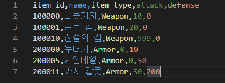
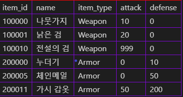

# CSV 파서(Parser) 만들어보기

CSV 파서를 만들어 봅시다. 프로그래밍에 익숙하신 분이라면 쉽게 따라하실 수 있도록 최대한 쉬운 난이도로 설명드리기 위해 최대한 노력했으니 개발하실 때 최대한 도움이 되셨으면 좋겠습니다.

아! 참고로 C# 언어 기준으로 코드가 작성되니 유의하세요. 물론, 다른 언어로 프로그램을 개발하시더라도 코드를 보시고 무슨 의미인지 파악하신다면 크게 문제가 되진 않을 듯 싶습니다.

## CSV가 뭐죠?
Comma-seperated values의 약자입니다! 직역하자면 '콤마(,)로 나뉜 값'이 됩니다. 구조가 매우 단순하고, 사람이 읽기 좋은 형식이기에 게임의 데이터 테이블에 자주 사용되는 형식입니다.
또한, 기존의 '스프레드 시트' 데이터 형식과 호환되어, 텍스트 에디터 뿐만 아니라 엑셀 혹은 기타 스프레드 시트 에디터로도 데이터를 쉽게 변경하실 수 있습니다.

## 기본적인 형식
게임 내에서 사용할 수 있는 장비의 데이터 테이블을 예시로 들어보겠습니다.

흔히들 '엑셀' 내지는 '스프레드시트'로 알고 계신 포맷으로 시각화가 가능한 구조입니다.



csv 파일을 텍스트 에디터로 연다면 이러한 모습입니다.

여기서 각 행(가로)줄은 각각의 객체를 표현할 수 있도록 하는 구분자의 역할을 하고, 각 열(세로) 줄은 객체의 속성을 구분하는 구분자의 역할을 합니다.



위의 csv 데이터를 시각화한다면 꽤나 보기 좋은 모양이 되네요.

첫 번째 행에는 데이터의 필드가 표현되어 있습니다. 두 번째 행의 '나뭇가지' 아이템은, 아이템 아이디가 100000이고, item_type(아이템 종류)가 Weapon(무기)이며 attack(공격력)은 10이고, 마지막 행의 '가시 갑옷'은 아이템 아이디가 200011이고, item_type(아이템 종류)가 Armor(방어구)이며 attack(공격력)은 50이고, defense(방어력)은 200이네요!

한 마디로 첫 행이 클래스라면, 나머지 행이 객체인 셈입니다.

이런 느낌으로, 주로 각 행마다 객체의 값를 콤마(,)로 구분지어 담는 형식으로 사용합니다.

## 게임에서의 사용
무엇보다도 중요한 것은 게임 내의 사용입니다. 접근법은 간단합니다. 위에 예시를 든 데이터를 기준으로 설명드리겠습니다.

우선, 가장 중요한 것은 저 데이터를 가지고 있는 객체가 먼저 존재해야 한다는 것입니다.

장비의 데이터를 저장하는 클래스인, `Equipment`를 코드로 표현해보겠습니다.

```csharp
// 아이템의 종류를 표현해줄 열거형식
public enum ItemType
{
    Weapon,
    Armor
}

public class Equipment
{
    // 아이템을 식별할 고유한 ID
    public int id;

    // 게임 상에서 보여줄 아이템의 이름
    public string name;
    // 이 아이템이 무슨 종류일까?
    public ItemType itemType;
    // 장비의 공격력
    public int attack;
    // 장비의 방어력
    public int defense;
}
```
이런 식으로, csv 데이터의 한 행에 정보를 모두 표현할 수 있도록 클래스를 설계했는데요, 실제로 csv 데이터를 보시면 클래스의 필드가 모두 대응되어 있습니다.

첫 행은 `item_id,name,item_type,attack,defense`으로 이루어져 있는데, 실제로 코드 내의 클래스의 필드에 모두 있는 요소들이고, 나머지 행에 들어가 있는 객체의 값의 형식은 클래스의 필드에 대입될 수 있을 법하게 이루어져 있지 않나요?

물론, 아직 csv 데이터는 그저 긴 문자열 데이터일 뿐이라 아직은 객체에 넣을 순 없지만요...

## 본격적인 파서 구현
이제 이 문자열 쪼가리를 통해 여러 바리에이션을 가진 객체를 양산해봅시다.

우선, csv 데이터는 여러 줄로 이루어져 있고, 각각의 줄은 콤마(,)로 분할되어 있습니다.

가장 먼저 할 일은 그 여러 줄을 나눠버리는 일이죠.

```csharp
string csvData;

...

string[] rows = csvData
                // 문자열의 끝 부분에 불필요한 공백이 들어가있을 수 있어 안전하게 손질해줍시다.
                .Trim()
                // 운영체제 혹은 텍스트 에디터마다 줄 바꿈 문자가 다를 수 있기 때문에 안전하게 나눠줍니다.
                .Split(new[] { "\r\n", "\r", "\n" }, StringSplitOptions.None);
```

줄을 성공적으로 나눴으면, 이제 콤마(,)를 기준으로 데이터의 필드를 구분해봅시다.

```csharp
// 첫 행 (0번 인덱스)는 데이터가 담겨있지 않고, 필드의 이름이 담겨있어 스킵!
for (int i = 1; i < rows.Length; ++i)
{
    var row = rows[i];
    var fields = row.Split(',');

    // TODO : 새 Equipment 객체를 만들어 fields 지역 변수의 데이터를 넣어준다.
}
```

그런데 `fields` 지역 변수에 데이터가 문자열 형식으로 담겨 있네요. 그런데 `Equipment` 클래스의 필드는 문자열만으로 값을 대입할 수 없지 않나요?

명심하세요! 프로그래머의 사전에 불가능이란 없습니다. 이럴 때 사용하라고 '생성자'라는 개념이 존재하니까요!

```csharp
public class Equipment
{
    // ...
    // 더 이상의 자세한 필드 선언은 생략한다.

    public Equipment(string[] fields)
    {
        // 첫번째 필드는 아이템 id.
        if (!int.TryParse(fields[0], out var id))
        {
            // 문자열 파싱에 실패했다면 예외를 띄우도록 하자.
            throw new Exception("(대충 csv id 데이터가 잘못되었다는 오류 메시지)");
        }
        this.id = id;

        // 두번째 필드는 아이템 이름(name). 문자열이므로 편하게 대입하자.
        this.name = fields[1];

        // 세번째 필드는 아이템 타입(itemType). 열거형 데이터는 파싱에 유의하세요!
        if (!Enum.TryParse<ItemType>(fields[2], out var itemType))
        {
            throw new Exception("(대충 csv 아이템 타입 데이터가 잘못되었다는 오류 메시지)");
        }
        this.itemType = itemType;

        // 네번째 필드는 아이템 공격력(attack).
        if (!int.TryParse(fields[3], out var attack))
        {
            throw new Exception("(대충 csv 공격력 데이터가 잘못되었다는 오류 메시지)");
        }
        this.attack = attack;

        // 다섯번째 필드는 아이템 방어력(defense).
        if (!int.TryParse(fields[4], out var defense))
        {
            throw new Exception("(대충 csv 방어력 데이터가 잘못되었다는 오류 메시지)");
        }
        this.defense = defense;
    }
}
```
생성자에 문자열로 이루어진 필드를 넣고, 그 문자열에서 데이터를 파싱해주면 그만입니다. csv 파서에서 데이터를 잘라 생성자에 넣어주기만 하면 객체가 뚝딱 완성되는 것이죠!

이 복잡한 공정이 끝난 후 비로소 우리는 길고 긴 csv 파일에 담겨진 데이터를 정제해 객체를 양산해냈습니다.

따라오시느라 고생 많으셨습니다! 혹시라도 궁금하신 점이 있으시다면 unengine@gmail.com 으로 편하게 메일 주세요~